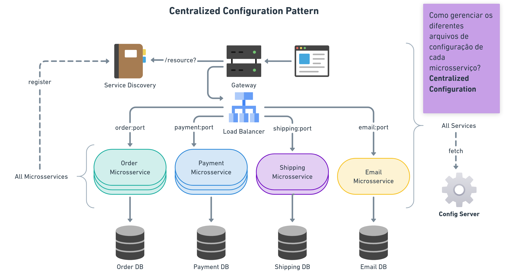

# About

Estudo sobre Microservices, juntamente com uma visão geral de padrão de projeto e arquitetura.

[Link Notion Giu Bezerra](https://giulianabezerra.notion.site/Descomplicando-Microsservi-os-7c267aca56664c0d95cb072cfcc9798f)

[Video](https://www.youtube.com/watch?v=5POMDqQw8hQ)

# O que são microservices

Seria uma visão macro, e dentro da solução do microservice, teríamos a aplicação de alguns **patterns**. Iremos entrar
mais a fundo sobre eles ja já!

Como podemos ver na imagem acima, temos vários serviços desacoplados (independentes entre sí), responsáveis por um 
contexto de negócio! Neste caso, um e-commerce.

Portanto, são **serviços menores, desacoplados e independentes** (**modulares**). **Paralelizam desenvolvimento**, **diferentes pilhas
tecnológicas**, são serviços **escaláveis**, com **responsabilidade limitada**, **cloud-ready** (Spring Boot + Spring Cloud).

Vamos agora adentrar nesse parágrafo ⬆️ e entender alguns pontos.

## Paralelizar desenvolvimento

No contexto de microsserviços, seria a capacidade de trabalhar em diferentes partes de um sistema de forma simultânea e
independente.

Ou seja, ao invés de termos uma **única** aplicação monolítica, exigindo que todos os desenvolvedores trabalhem juntos
na mesma base de código e no mesmo processo de desenvolvimento, os microsserviços permitem que equipes distintas **possam
trabalhar em diferentes serviços de uma maneira isolada**, mas que, no final, colaboram entre sí para formar um sistema
completo.

Um adendo: cada equipe pode trabalhar no serviço que é responsável, utilizando diferentes tecnologias.

## Serviços menores, desacoplados e independentes

Cada microsserviço é uma parte pequena e independente de um sistema maior, focando em uma só responsabilidade.

Eles são **desacoplados**, ou seja, não dependem diretamente uns dos outros para funcionar. 

Isso permite que eles sejam modificados e implantados de maneira independente.

## Modulares

Como os microsserviços são pequenos e focados em uma única funcionalidade, eles são altamente **modulares**.

Isso significa que podem ser: desenvolvidos, testados, implantados e escalados **SEPARADAMENTE**.

## Diferentes pilhas tecnológicas

Como cada microsserviço é independente, ele pode ser desenvolvido utilizando diferentes tecnologias (conforme citados no
paralelismo).

Isso engloba: linguagens de programação, banco de dados e frameworks, acaba dependendo da necessidade do serviço.

Por exemplo, um microsserviço pode ser feito em Java, outro em Node.js e outro em Python e tudo isso dentro do mesmo
sistema, exatamente como podemos ver na imagem acima! Alguns feitos com Java, Outro com PHP e por aí vai.

## Escalável

Microsserviços podem ser escalados de forma independente, ou seja, caso um serviço precise de mais recursos devido a 
aumento de carga, ele pode ser escalado sem afetar outros serviços (ver de novo isso).

Ou seja, um sistema escalável pode crescer ou ser ajustado conforme a necessidade, seja aumentando recurso ou distribuindo
carga de maneira inteligente.

## Responsabilidade limitada

Cada microsserviço tem uma única responsabilidade ou função específica. Isso acaba tornando o código mais claro e fácil
de manter.

## Cloud ready

Microsserviços são ideais para ambientes em nuvem (cloud), pois podem ser facilmente distribuídos, escalados e 
gerenciados usando plataformas de nuvem.

## Spring Boot + Spring Cloud

Essas são ferramentes do ecossistema Java que facilitam o desenvolvimento de microsserviços.

O Spring Boot simplifica a criação de aplicações Java independentes e prontas para produção.

Já o Spring Cloud, oferece funcionalidades para gerenciar microsserviços distribuídos, como: configuração centralizada,
descoberta de serviços, tolerância a falhas, etc.

# Comunicação entre microsserviços

Bom, aos realizarmos a separação dos microsserviços, temos alguns pontos que precisam ser tratados para que eles possam
se comunicar.

Para isso, existem alguns patterns que podemos aplicar para resolver esses problemas de arquitetura que vão aparecendo
ao separar serviços.

## HTTP Protocol

Antes de falarmos sobre os patterns, vamos abordar brevemente o protocolo HTTP!

Várias aplicações, cada um com seu banco de dados.

Antes ficava tudo no mesmo pacote (quando se é monolítico), correto? O Order chamava o Shipping e por aí vai...

Como agora temos vários serviços e estão separados, precisamos nos comunicar **PELA REDE**, pois são sistemas distribuídos.

Para realizarmos essa comunicação via HTTP, cada serviço precisa estar em uma porta específica, veja:

O problema desse esquema não monolítico é o seguinte: como fazer para organizar essas múltiplas chamadas pela rede,
gerenciando esses endereços de forma mais simples? Agora, sim, veremos um pattern: **API Gateway**.

## 1º Pattern, API Gateway - Simplificando chamadas

É usado como ponto central de acesso para roteamento entre vários microsserviços. A gente coloca ele no meio para lidar
com essas chamadas.

Então a ideia agora é a seguinte: antes, o nosso SPA (o frontend) chamava os serviços diretamente. Agora, ele passa a
chamar um recurso do gateway (não mais os serviços diretamente).

Então se ele recebe um recurso para "/orders", encaminharemos a requisição para o serviço de pedidos.

Exatamente como citamos acima, o gateway é um ponto central para acessarmos os microsserviços, minimizando aquela bagunça
do frontend fazendo chamada para todo mundo.

Frisando, pode-se ver na imagem que o gateway possui as rotas para os microsserviços: "/order, /inventory". Ele acaba
funcionando como um "mapa" de endereços.

**❗Um problema! Até aqui, nós centralizamos os endereços no API Gateway, mas nós só mudamos a gerência dos endereços!**

O Gateway ainda precisa saber os DNS e portas dos serviços, lidando com as informações ⬇️.

## 2º Pattern, Service Discovery

Para o nosso Gateway saber onde fica os microsserviços, ele irá consultar um **Service Discovery**. Ele irá possuir os 
dados de TODOS os microsserviços e instâncias que estão rodando, **como se fosse uma agenda telefônica.**

Cada microsserviço irá se registrar nele assim que fica no ar.

Imagine que a gente faça uma requisição solicitando um recurso em "/orders", por exemplo. O Service Discovery vai nos
responder, apontando para o microsserviço correspondente.

### Como o Service Discovery sabe dos endereços baseado nos recursos?

Ele sabe porque todos os microsserviços quando se iniciam, são registrados nele!

Então até o momento, centralizamos também o gerenciamento de endereços em um componente que só tem essa responsabilidade!

Mais um problema resolvido, correto? Mas ainda temos alguns problemas com essa arquitetura: e se houver mais instâncias
do mesmo serviço? Trabalharemos com o Load Balancer Pattern. ⬇️

## 3º Pattern, Load Balancer

No mundo real temos mais de uma instância para ter redundância nas respostas dos microsserviços. Mas com mais de uma
instância, como saberemos QUEM chamar? QUEM está desocupado?

O Load Balancer, é um **balanceador de carga**, responsável por fazer requisições à diferentes instâncias de um mesmo 
microsserviço. **Ele vai direcionar as requisições que irão chegar para diferentes instâncias do MESMO serviço**.

**Observe na imagem que agora temos várias instancias rodando ao mesmo tempo! Uma com 3, outra com duas...**

E agora também não temos mais a ideia de acessar o endereço e uma porta específica. Se você reparar nas imagens acima
acessamos por exemplo ``order:8080``. 

Agora, o Gateway chama o Load Balancer e ele por sua vez, direciona para a porta correta: ``order:port``.

Frisando que o Load Balancer faz um trabalho de "Round Robin". Ou seja, a primeira requisição vai para a primeira 
instância e assim sucessivamente.

## 4º Pattern, Centralized Configuration

Cada um dos nossos serviços tem suas configurações. Como estamos lidando com Spring Boot, a gente utiliza o ``application.properties``.
Para lidar com acesso a banco, endereço de serviços externos, etc.

Porém, com um grande número de microsserviços, temos um grande número de arquivos de configuração.

Esse pattern será responsável por gerenciar essas configurações. Utilizaremos um "Config Server", um componente, onde
irá centralizar todos os arquivos de configuração, e ainda será possível atualizar as props sem derrubar os microsserviços.

Esse componente ``Config Server``, levará também até mesmo o arquivo de configuração do Gateway.

E é conforme citamos acima, com esses arquivos centralizados em um só local, é mais fácil de ajustar o que for necessário,
sem afetar o programa.

## Alternativa para uso de HTTP? 

Sabemos que o HTTP é uma relação síncrona, ou seja, nosso SPA (frontend) vai esperar as chamadas serem respondidas
e teremos algumas esperas se tivermos chamadas entre serviços (essas chamadas também são sincronas).

Isso compromete a disponibilidade do nosso sistema. Se um serviço cai, será que precisamos tornar todo o e-commerce
indisponível?

Então temos outras formas de comunicação entre serviços além da inter service (serviço para serviço de forma sincrona).

Aí que vem o Event Driven. ⬇️

## 5º Pattern, Event Driven PUB/SUB

A ideia é que a gente utilize uma conexão baseada em **eventos**.

Antes, tínhamos requisições sendo feitas diretamente, chegando no SPA, indo para o Gateway, depois orquestrando uma
requisição por vez.

Agora faremos o mínimo de chamadas possível via Gateway, e as outras etapas de comunicação podemos fazer via Message
Broker, conforme podemos ver pela imagem abaixo.

Message Broker é um enviador e recebedor de mensagens. Por exemplo, quando um pedido é feito, a gente pode notificar
o sistema de pagamento. Mas não precisa chamar o sistema de pagamento direto, a gente pode mandar uma mensagem e quando
o sistema de pagamento receber uma mensagem desse tipo ele já vai ficar "ouvindo", para que ele possa trabalhar/processar.

E por sua vez, esse sistema de pagamento, ao começar a processar, poderá enviar OUTRA message para outro service.

Você pode observar isso na imagem acima. As setas são bidirecionais, assim como recebem mensagens, as envia de volta...
tudo isso de forma assíncrona!

Ou seja, se um serviço fica momentaneamente de fora, quando ele voltar ao ar, poderá buscar a mensagem recebida e 
processá-la de acordo.

Esse modelo também é chamado de PUB/SUB. Visto que, alguém publica uma mensagem no broker e sub, pois alguém se inscreve
para recebê-las.

### Tipos de mensagens

Query - Consulta, retornar dado correspondente.

Command - Fazer algo, processamento. Criar registro, atualizar, etc.

Event - Notificação para interessados em fazer algo a respeito, processar algo que é responsabilidade dela.

Então podemos, dependendo do tipo da mensagem, criar um fluxo completo para cada funcionalidade do sistema.

Desde fazer um pedido, até ativar o pagamento desse pedido, o serviço de entrega... tudo será orquestrado por essa
comunicação assíncrona através de mensagens específicas enviadas ao Message Broker.

Com esse processamento assíncrono, trabalharemos com um conceito super importante: Consistência Eventual.

### Consistência Eventual

Nesse modelo atual, significa que em algum momento, eventual o pedido será feito, o pagamento ativado com enviado de 
e-mail, ele será eventualmente **COMPLETO**.

Nós falamos eventual porque é um processo assíncrono, não sabemos QUANDO, mas sabemos que será finalizado, depende de cada
serviço fazendo seu trabalho.

## Outros Patterns

Temos também outros padrões, como: Distributed Tracing, Circuit Breaker, Access Token, você pode checá-los esses e 
outros [aqui](https://microservices.io/patterns/index.html).

# Visão Dados

Agora que falamos de aplicação, falaremos dos dados!

Patterns que se relacionam com a forma que os dados são criados/manipulados dentro de um banco de dados. Um dos patterns
que atende essa necessidade é o **Event Sourcing, advindo do Event Driven**. ⬇️

## Event Sourcing

Imagine que temos um Record, um User. Em um sistema tradicional, alguém manda uma requisição POST para criar um Usuário,
ele vai para o banco de dados com todas as informações, nós vamos ele completo no banco de dados.

Já no Event Sourcing, ao invés de criar um registro e salvá-lo por completo, nós salvamos os eventos com as mudanças
necessárias para construir esse estado.

Então ao invés de salvar ``login, email, password``, salvaríamos um evento de ``USER CREATED``, com as informações da
criação do usuário para que eventualmente possamos reproduzí-la.

Se fosse um update, por exemplo, poderíamos salvar só o item atualizado. Se só a senha mudou, manter somente o registro
da nova senha.

Como podemos ver na imagem acima, temos 3 eventos disparados: created, updated e deleted.

Esses eventos são enviados para o service, processados e enviados para uma ``Event Store``. Com os eventos processados
enviamos para um barramento de eventos ``Eventbus`` (basicamente o Message Broker), precisa ser alguém que receba
os eventos de forma assíncrona.

E por fim, teremos uma base de dados que terá o estado final do registro, que irá consumir os eventos e construir o item 
final.

No nosso caso, se executarmos na ordem os 3 eventos disparados, teremos um item com status ``deleted``. E sim, ele terá
os dados da criação e da atualização que aconteceu antes do delete.

Portanto: para saber o estado final do item, precisamos só executar a sequência de eventos.

Isso é importante, porque esses eventos são **IMUTÁVEIS**. Então se tivermos um cenário de perda/deleção, podemos
reproduzir os eventos, pegando o ÚLTIMO estado consistente! É mais difícil de perder a integridade dos dados.

Por isso algumas aplicações é interessante usar o Event Sourcing (advindo do Event Driven).

**Caso trocássemos de banco, é a mesma coisa... é só dar um replay nos eventos e construir o item final.**

## CQRS

Estratégia constantemente utilizada com o Event Sourcing. 20:37